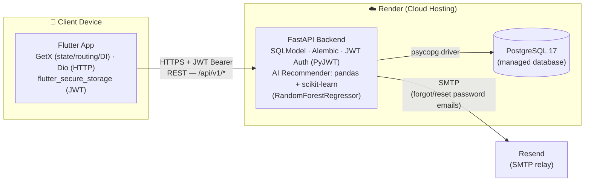

# System Architecture & Tech Stack

Reference doc for the master's final-project demo. Covers the Flutter client (this repo) and the FastAPI backend it consumes (sibling repo [`hr-leave-management`](https://github.com/sokhai-cambodia/hr-leave-management)).

## System Diagram

**How it fits together:**
- The Flutter app is the only client — no web/desktop UI is part of this project's scope.
- All communication is stateless REST over HTTPS: the app logs in once (OAuth2 password flow), stores the JWT in secure storage, and attaches it as a Bearer token on every subsequent call. There's no refresh token — a token lasts 8 days, and any 401 forces re-login.
- The backend is a single FastAPI service; the AI leave-plan recommender runs in-process (trains a small `RandomForestRegressor` per request, not a separate microservice).
- Both the backend and its Postgres database are hosted on Render's free tier — the whole demo runs without anyone needing to run a local backend.
- Password-reset emails go out through Resend's SMTP relay rather than the backend sending mail directly.

## Tech Stack

### Client — this repo

| Layer | Technology |
|---|---|
| Framework | Flutter (Dart, null-safety) |
| State management / routing / DI | GetX |
| HTTP client | Dio |
| Secure token storage | flutter_secure_storage |
| Local key-value cache | GetStorage |
| Calendar UI | table_calendar |
| QR / sharing | qr_flutter, share_plus, gal (save to gallery) |
| App icon generation | flutter_launcher_icons |

### Backend — sibling repo (consumed, not built by this project)

| Layer | Technology |
|---|---|
| API framework | FastAPI (Python 3.10+) |
| ORM / models | SQLModel (SQLAlchemy + Pydantic) |
| Migrations | Alembic |
| Database | PostgreSQL 17 |
| DB driver | psycopg |
| Auth | JWT (PyJWT) + OAuth2 password flow, passlib/bcrypt for hashing |
| AI recommendation engine | pandas + scikit-learn (RandomForestRegressor) |
| Email | Jinja2 templates + SMTP (Resend relay) |
| Error tracking | Sentry SDK (optional) |

### Infrastructure

| Concern | Choice |
|---|---|
| Backend + DB hosting | Render (free tier; backend is a Docker web service, DB is a managed Postgres instance) |
| Local backend dev | Docker Compose (Postgres, Adminer, Mailcatcher for email capture) |
| CI-friendly config | Backend base URL injected via `--dart-define=API_BASE_URL` or `.env`, never hardcoded (see `lib/core/constants/env.dart`) |

## Notes for the demo

- The course guideline specifies Spring Boot for the backend; this project deliberately substitutes an already-built FastAPI backend instead (documented decision — see `SPEC.md` §7 "Known Gaps vs. Guideline").
- Render's free tier spins down on idle, so the very first request after inactivity can take 30–60s to respond — worth mentioning live if the demo pauses before a network call.
