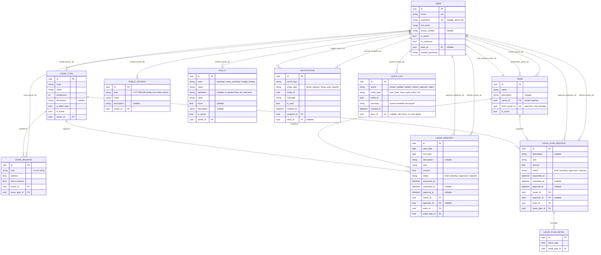

# Entity-Relationship Diagram

Generated directly from the backend's SQLModel table definitions (`../hr-leave-management/backend/app/models.py` and `backend/app/leave_models/*.py`) — not hand-drawn, so it stays accurate to the actual schema. Covers the HR Leave Management domain; the FastAPI template's leftover `Item`/`User.items` demo table is intentionally omitted (unused scaffolding, not part of this project's business domain).

## Diagram

## Notes

- **`owner_id` on `LeaveType`/`PublicHoliday`/`Policy`/`LeaveBalance`** means "created/managed by this admin user," not "belongs to this employee" — these are master-data tables. `LeaveBalance.owner_id` is the exception: there it genuinely means "this employee's balance."
- **`Team` has two distinct FKs to `User`**: `owner_id` (who created the team record, always an admin) and `team_owner_id` (the line approver whose pending-approvals queue and Approvals nav entry are driven by this field — see `CLAUDE.md`'s "team owner" heuristic). They are usually, but not necessarily, the same person.
- **`LeaveRequest`/`LeavePlanRequest.approver_id`** is nullable and only populated once a request is submitted (an employee with no team, or a team with no `team_owner_id`, can have a request stuck without an approver — surfaced client-side as a friendly error, see `tasks/plan.md` Task 4.3).
- **`available_balance`** on `LeaveBalance` is a computed property (`balance - taken_balance`), not a stored column — shown here because it's part of the API contract (`LeaveBalancePublic`), not because it's a DB field.
- **`PublicHoliday.date`** is a plain string column (`"YYYY-MM-DD"`), not a SQL date type — a deliberate backend inconsistency also called out in `CLAUDE.md`'s "Backend contract quirks" section.
- **`AuditLog`** is written internally (by `AuditService`, as a side effect of the mutations it describes) — there is no create/update/delete endpoint for it, only `GET /audit-logs/` (superuser-only). `actor_id` is nullable with `ON DELETE SET NULL` so an entry survives even if the acting user's account is later deleted; `summary` captures a human-readable description at write time so the trail stays legible even then.
- Not shown: the FastAPI template's original `Item`/`User.items` table — present in the codebase as unused scaffolding from the starter template, not part of the HR Leave domain.

## Source of truth

Regenerate this by re-reading the model files directly if the schema changes — there is no automated diagram-generation step wired into either repo's build.
